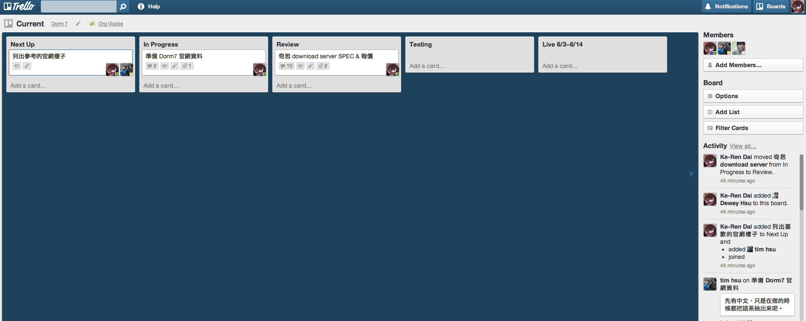

# Project Management with Trello

[Trello](https://trello.com) 可以視為實體的板子，Board 可以對比為牆壁，List 可以對比為直欄，Card 則是像便利貼的概念。下圖是個 Trello Board 的例子：

其中，Current 為一個 Trello Board。Next Up、In Progress、Review 為 List，"準備 Dorm7 官網資料" 則是一張 Card。

## General Rules

* 每個 List 當中的 Card 依照 priority 排列，priority 越高的 Card 放在 List 越上面
* 在 Card 上面的大頭代表負責此項工作的人，在需要他人回應或是告知時，務必以 @ 做 notification

每個 Project 會開啟一個 Project Board 作為追蹤，此外，Current Board 代表本週正在進行的事項。以下分別針對 Project Board 跟 Current Board 的項目做說明。

# Project Board

每個 Project Board 都有三個 List，分別為

* IDEAS
* TODO
* Ready for Next Up

對於每個 List 說明如下：

## IDEAS

這邊列出一些跟 Project 相關的想法，只要跟 Project 有相關的隨想、資訊都可以列在這邊。

## TODO

當 IDEAS 當中的想法明確確定之後，將想法轉成實際可行動的 Action Item 並成為 TODO List 當中列出的 Card。

## Ready for Next Up

在 Ready for Next Up 這個 List 當中，記著將 TODO 裡面的 Action Item 拆解之後的 Card。每張 Card 當中所敘述的 Task 工作時數不得超過一週 (五個工作天)。如果估計此 Card 的工時會超過一週時，應該拆解為多張 Card。此 List 當中的 Card 依照 Priority 排序，Priority 越高的 Card 排在越上面。

# Current Board

Current Board 當中列的為本週正在進行的工作，共有五個 List，分別為：

* Next Up
* In Progress
* Review
* Testing
* Live

對於每個 List 說明如下。

## Next Up

此 List 當中為本週預計待辦事項，當中的 Card 來自於 Weekly Meeting 當中的討論，關於 Weekly Meeting 請參照 Weekly Meeting section。

Next Up 當中的 Card 依照 Priority 排序，Priority 越高的 Card 排在越上面。

## In Progress

此 List 當中為正在進行當中的工作，每個 Card 代表一項工作，每項工作的負責人將自己的大頭 Assign 到負責的 Card 當中。在此 List 當中，每個人的大頭最多出現在兩張 Card 上面，避免 multi-tasking 造成效率低落。

## Review

當 In Progress 裡面的工作完成後，如有需求，將 Card 移至 Review 當中，以 @ notification 請他人 Review。Reviewer 將自己 Assign 至 Card 上，並給予相對應的 review comment。

## Testing

完成的 Feature、Prototype 等等如果需要測試的 Card，移至 Testing 當中。

## Live

每週完成的 Card 會放在 Live List，Live List 會標註長度為期兩週的期間。

# Weekly Meeting

每周會有兩次的 Meeting 來了解大家的狀況，分別為禮拜一的 Plan Meeting 以及週五的 Review Meeting，以下對這兩個 Meeting 分別做說明。

## Plan Meeting

在每週一的午餐過後進行，目的為計畫一週當中所要做的事情，以及釐清目前發生的事情。程序如下：

* Archive 兩週前的 "Live" list
* Review 各個 Project Board，將 IDEAS、TODO 做適當的釐清和拆解，並且把可能的 action item 放到 Ready for Next Up 當中
* Review 各個 Project Board 當中的 Ready for Next Up List，重新依照 Priority 做排序，並且每個人依照自己當週的狀況將 Ready for Next Up 當中的 Card 移至 Current Board 當中的 Next Up List

## Review Meeting

在每週五的午餐過後進行，目的為 Review 本週的狀況，程序如下：

* Review 本週移至 Live List 當中的 Card，大概重新講一下每張 Card 上面的工作內容，然後大家拍拍手說棒棒！
* Review 其他尚未的移到 Live List 的 Card，釐清可能發生的問題或狀況

